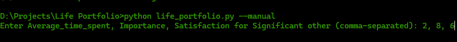
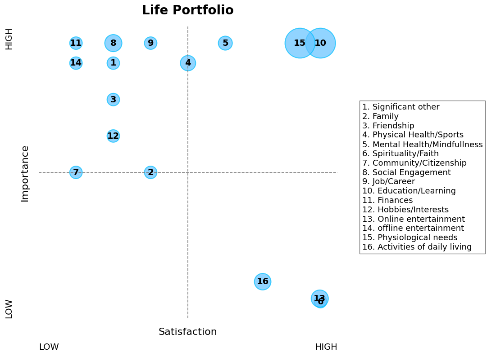

# Life Portfolio Visualization

This project helps you visualize different areas of life based on **time spent, importance, and satisfaction**.  
It creates a **bubble scatter plot**, where:
- X-axis = Satisfaction  
- Y-axis = Importance  
- Bubble size = Average time spent  

You can either:
- Load a **sample dataset** (default),  
- Provide your own dataset file, or  
- Enter data **manually** for all categories.  

---


## Background & Motivation
In life, we often juggle multiple responsibilities and priorities. 
This project is based on the concept of a **Life Portfolio**, where 
different areas of life (SLAs – Strategic Life Areas) are tracked in 
terms of:
- **Average Time Spent** (effort / attention you give)  
- **Importance** (how much it matters to you)  
- **Satisfaction** (how happy you are with it)  

By visualizing these dimensions, we can reflect on questions like:
- Am I spending time on what truly matters?  
- Are there areas that are important but neglected?  
- Where can I rebalance my energy for better well-being?  

The goal of this tool is not just data analysis, but **personal reflection**.

## Inspiration
This project was inspired by the Harvard Business Review article  
**"Use Strategic Thinking to Create the Life You Want"**.  

The idea of treating different **Significant Life Areas (SLAs)** as a portfolio — 
similar to how investors manage financial assets — resonated strongly with me.  
By visualizing time spent, importance, and satisfaction, we can apply  
strategic thinking to personal well-being and life choices.

---

##  Features
- Optional **manual input** for 16 life categories (SLAs).  
- Uses **pandas** for data handling and **matplotlib** for visualization.  
- Customizable dataset via `--datafile` flag.  
- Clear scatter plot with labeled categories.  

---

##  Requirements
- Python 3.8+  
- Install dependencies:
  ```bash
  pip install pandas matplotlib

## Usage
 - Default (sample dataset)
 ```bash
    python life_portfolio.py
 ```   
    This will load the sample dataset provided in the data/ folder.

 - Custom dataset 
```bash
    python life_portfolio.py --datafile mydata.csv
```
    This will take the dataset provided by the user, use your "filename.csv" in place of "mydata.csv"

 - Manual input
 ```bash
    python life_portfolio.py --manual
```
    In this, you are required to enter values corresponding to each SLUs mentioned in the prompt.

## 📝 Example Data Entry

When using `--manual` mode, the CLI asks for structured inputs:



## 📊 Example Output

Here’s what the visualization looks like with sample data:



## Futute Improvements
 - Saving plots
 - Adding interactivity
 - Better UI